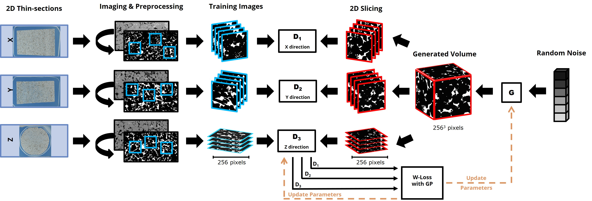

## True 2D-to-3D Reconstruction of Heterogenous Porous Media via Deep Generative Adversarial Networks (GANs)
 This repository provides codes for 3D image reconstructions using only 2D images scanned from orthogonal planes of a berea sandstone. Our work is currently under review, but you can refer to the [preprint](https://doi.org/10.22541/essoar.170965049.96322870/v1) for more details. The model, named SliceGAN, was originaly intoduced by [Kench and Cooper(2021)](https://github.com/stke9/SliceGAN). However, the original model was designed to use slices of a ground-truth 3D volume for training. Here we introduce several modifications to the original approach. Our contributions are:
 1) Modifying the sampling workflow and dataloaders to take random images of representative sizes from three 2D images obtained from different orientations.
 2) Adding a model evaluation to the training loop based on the calculation of two-point correlation function in 2D (for training images) and 3D for generated volumes in different planes.
 3) Changing the architecture of Generator and Discriminator to reduce the chekerboard patterns, as well as operating on larger images of resolution 256.

 ## Training workflow
 After the preparation of thin sections, we acquired large-area BSE and optical images, which are then segmented into pore and solid phases. Subsequently, we extract random crops with representative elementary size (RES) from these 2D images, taken from different orientations. To calculate the representative size from your 2D images run `RES.py` first. If this size is too large and your computational resource is not enough, you can resize it upon loading the data (see `train.py`). In our case, RES size for BSE images were 384 which were then resized on-the-fly to 256 pixels due to our GPU memory constraints. In the next step, these images are fed to the 3 discriminators for each orientation x, y, z. The discriminator also receives slices from different orientations of the generated image by the generator.
 

 ## Usage
 ### Overview
Here is the summary of scripts in this repository:
- ``REV.py``: Calculates representative elementary volume from a 3D image, if applicable.
- ``RES.py``: Calculate representative elementary size for 2D images.
- ``train.py``: Trains the modified SliceGAN using 2D images.
- ``inference.py``: Generates 3D images using a pre-trained generator.

 ### Representative elementary size (RES) analysis
 Before training your model for 2D-to-3D reconstructions, representative image size should be determined. If you have a 3D ground-truth volume of your sample, run:
```
python REV.py --image_dir 'full path to your 3D binary image' \
--image_sizes 64 128 256 350 400 \
--n_rnd_samples 50 --output_dir 'path to save the output'

# this will calculate average $S_2$ and $F_2$ in three dimensions \
and save them as a dictionary `*.pkl` files in the `output_dir`.
```
### Training your own model
 For training the model using your 2D images. you need three (for anisotropic microstructure) 2D binary images (with value 1 showing your phase of interest). To train your own model run:
 ```
 python train.py --dir_img_1 Data\BSE_images\X_R3_binary.tif \
 --dir_img_2 Data\BSE_images\Y_R2_binary.tif \
 --dir_img_3 Data\BSE_images\Z_R1_binary.tif \
 --RES 384 --train_img_size 256 --batch_size 2

 ```
### Generate images using pre-trained models
 After training, your best model will be saved in a folder in the specified directory. Then, for generating images using pre-trained model "run the following script.
 ```
 ## Here is an example to generate using the generator trained with BSE images:
 python inference.py --G_pkl Path\to\yourfolder\*.pt
 --ngpu 1 --num_img 100 img_size 256 --z_size 4.

 ``` 
 `img_size`: the image size you used for training your model. For generating images larger than your training images, you can run the inference with larger `z_size` e.g., 6 to generate $512^3$.

 ## Dataset and pre-trained models
 All dataset used in our paper and pre-trained models can be downloaded from the following links:

| Path | Size | Format | Description |
| :--- | :--: | :----: | :---------: |
| [XCT images](https://drive.google.com/file/d/1cX8SISCeEQCeTIddzLySBwAL8IXRkZXC/view?usp=drive_link) | 128.1 MB | tif | X-ray tomography image
| [BSE images](https://drive.google.com/drive/folders/1lHXqiq627X1z7EJTagvoYkqjXUdV-a9r?usp=drive_link) | 27 MB | | Folder containing binary backscattered 2D images in X, Y, and Z directions.
| [Optical images](https://drive.google.com/drive/folders/198PSDMM1vjrd0lANq43euVwHINft96Hp?usp=drive_link) | 4.37 GB | | Folder for optical images
| [Generator BSE](https://drive.google.com/file/d/1Eve0lMVXUOmQpqGzZG4bK-xkK3du-ttY/view?usp=drive_link) | 691.1 MB | pt | Generator trained with BSE images
| [Generator Optical](https://drive.google.com/file/d/1TiusyUWFmz6lb_NrNtxlUpngRvqO1lSQ/view?usp=drive_link) | 691.1 MB | pt | Generator trained with Optical images


 

 